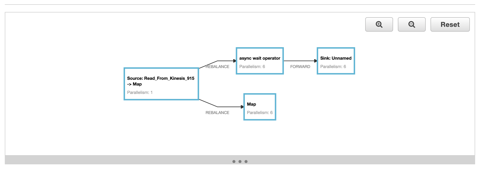
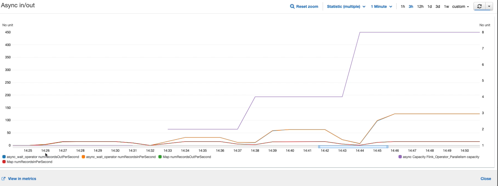

# Async IO for Flink Applications with Amazon Managed Service for Apache Flink (formerly Amazon Kinesis Data Analytics)

--------
>  #### 🚨 August 30, 2023: Amazon Kinesis Data Analytics has been renamed to [Amazon Managed Service for Apache Flink](https://aws.amazon.com/managed-service-apache-flink).

--------

This project is heavily influenced by the Apache Flink AsyncIO documentation and code samples which describe the methods for making asynchronous calls to an external data source. The overall idea behind the AsyncIO function is that we are utilizing the fact that this call can be made asynchronously (at the same time as other requests) to ultimately improve throughput.

## How does it work?
This codebase reads from a Kinesis Data Stream, invokes the AsyncFunction with an Apache HTTP Client and posts to an HTTP endpoint. The results are then returned asynchronously and streamed to the sink (KDS). This was done to showcase that the throughput was keeping up despite a slow Rest API.

It also performs the same Rest API call synchronously via a Map function. This was done for illustrative purposes, and should not be done in production. If you need to control concurrent requests to an external data source, use `capacity` instead.

## Some considerations:
The most important parameters when defining an AsyncFunction are:
- Capacity - how many requests are in-flight concurrently per parallel sub-task
- Timeout - the timeout duration of an individual request to the external data source.

Ensure you are allocating enough capacity to account for the throughput, but not more than the external data source can handle. 

Example Application with **parallelism** of **5** and **capacity** of **10** will send 50 concurrent requests to your external data source.